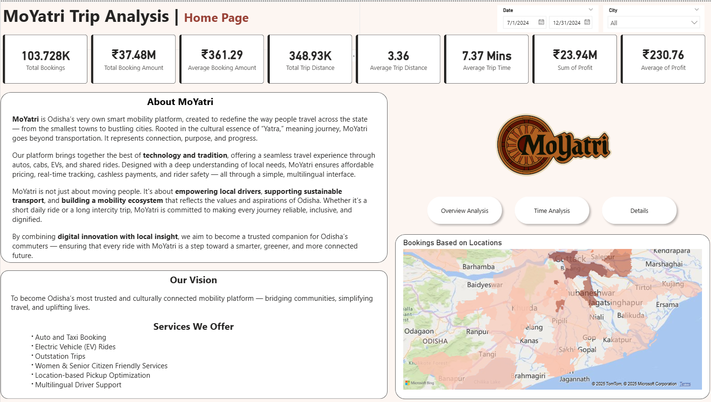
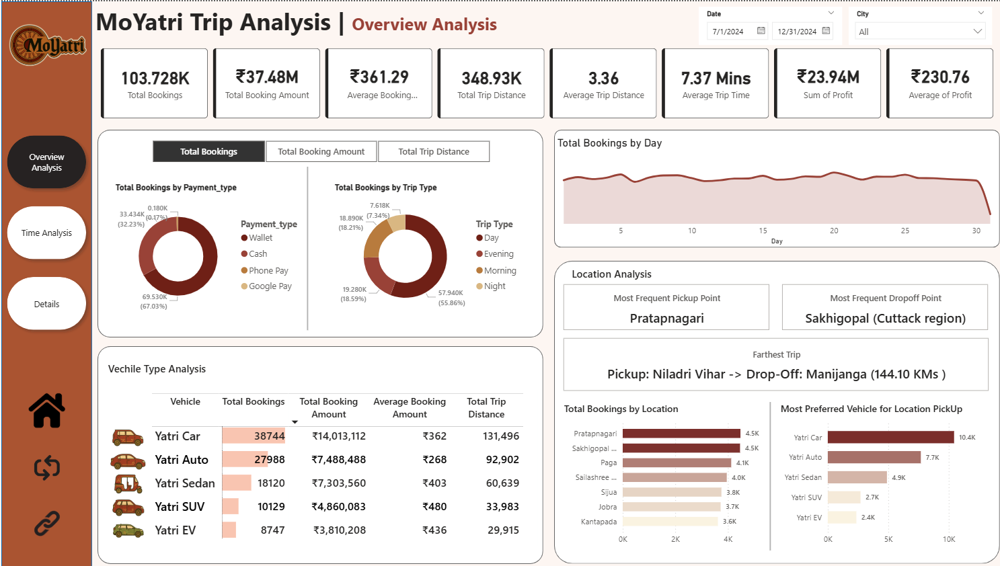
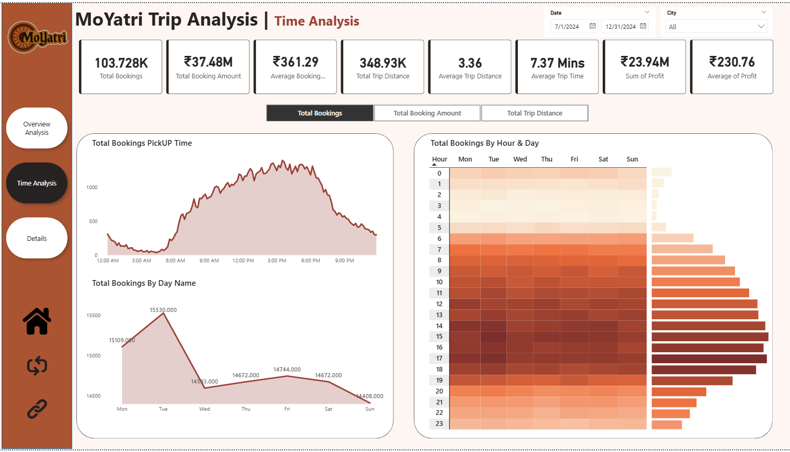
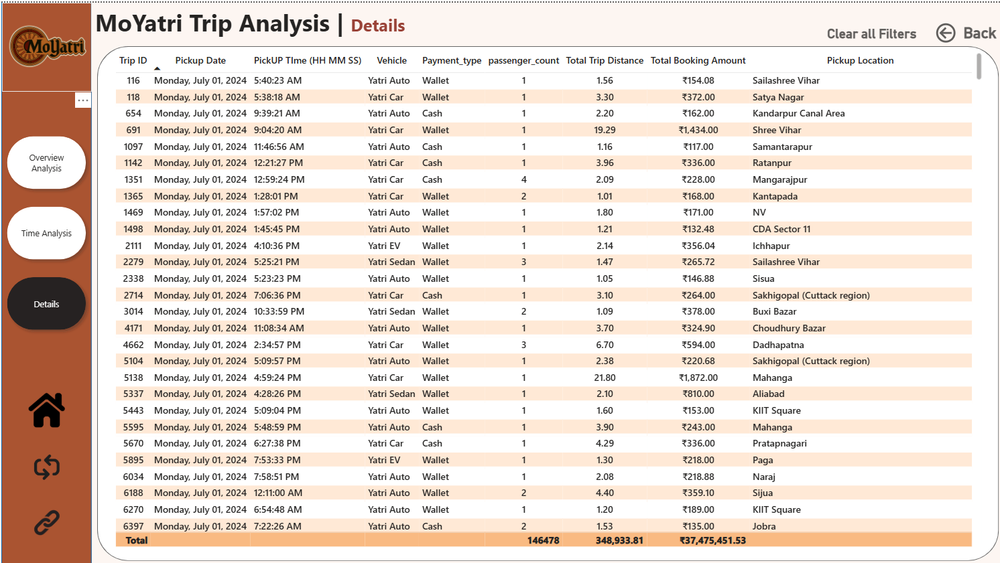

# MoYatri Trip Analysis – Power BI Dashboard

MoYatri is Odisha’s homegrown smart mobility platform aimed at redefining urban and intercity transportation through technology, cultural sensitivity, and innovation. This Power BI project visualizes booking data to derive insights into trip performance, customer behavior, vehicle usage, and operational efficiency.

---

## Project Summary

This report analyzes **MoYatri's booking data from July to December 2024**, providing rich insights into:

- Trip performance metrics
- User behavior trends
- Vehicle type comparisons
- Location-based analytics
- Time-based and financial performance

---

## Key Metrics

| Metric                   | Value         |
|--------------------------|---------------|
| Total Bookings           | 103.7K        |
| Total Booking Amount     | ₹37.48M       |
| Average Booking Amount   | ₹361.29       |
| Total Trip Distance      | 348.93K KM    |
| Average Trip Distance    | 3.36 KM       |
| Average Trip Time        | 7.37 Minutes  |
| Total Profit             | ₹23.94M       |
| Average Profit per Trip  | ₹230.76       |

---

## Dashboard Pages

### 1. **Home Page**

- KPI Cards: Trip count, distance, profit, etc.
- Platform Vision and Services
- Location heatmap for booking density
- Date and City filters

---

### 2. **Overview Analysis**

- Bookings by:
  - Payment Type
  - Trip Type
  - Day of the Month
- Location Analytics:
  - Most Frequent Pickup/Dropoff Points
  - Farthest Trip
- Vehicle Type Comparison:
  - Bookings, Revenue, Distance

---

### 3. **Time Analysis**

- Bookings by:
  - Time of the day
  - Day
  - By Hour and Day
- Total Booking Amount by:
  - Time of the day
  - Day
  - By Hour and Day
- Total trip distance by:
  - Time of the day
  - Day
  - By Hour and Day

---

### 4. **Details Page**

Granular data visualizations and deep dives for internal ops and performance optimization.

---

## How to Use

### Step 1: Download the Report
- Clone or download this repository
- Locate the file: `MoYatri Dash V9.0.pbix`

### Step 2: Open in Power BI Desktop
- Install [Power BI Desktop](https://powerbi.microsoft.com/desktop/)
- Open the `.pbix` file

### Step 3: Interact with the Dashboard
- Use date and city slicers to filter data
- Click through the navigation buttons (Home, Overview, Time, Details)
- Hover over visuals for tooltip insights
- Analyze metrics like bookings by vehicle, profit by city, and user behavior

---

## Tech Stack

- **Tool:** Microsoft Power BI Desktop
- **Data Type:** Aggregated booking data (July–Dec 2024)
- **Visuals Used:**
  - KPI Cards
  - Donut & Bar Charts
  - Map Visual (Heatmap)
  - Line Charts
  - Matrix Tables
  - Custom Navigation Buttons

---

## Features

- Filter by **Date Range** and **City**
- Visual breakdown by **Payment Method** and **Trip Type**
- Location heatmaps for **Pickup/Drop-off Density**
- Real business KPIs for performance tracking
- Insights into **preferred vehicle types** and **trip patterns**

---

## 👤 Author

**Abhisek Jena**   
📧 [abhisek.jena48@gmail.com] 

